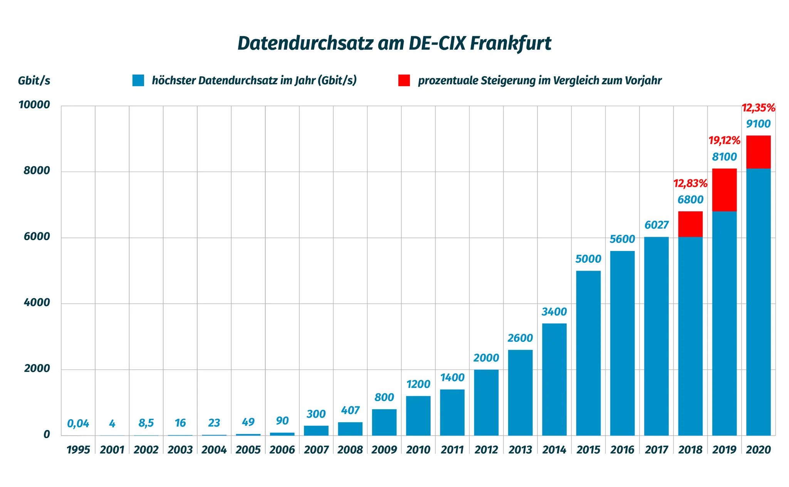
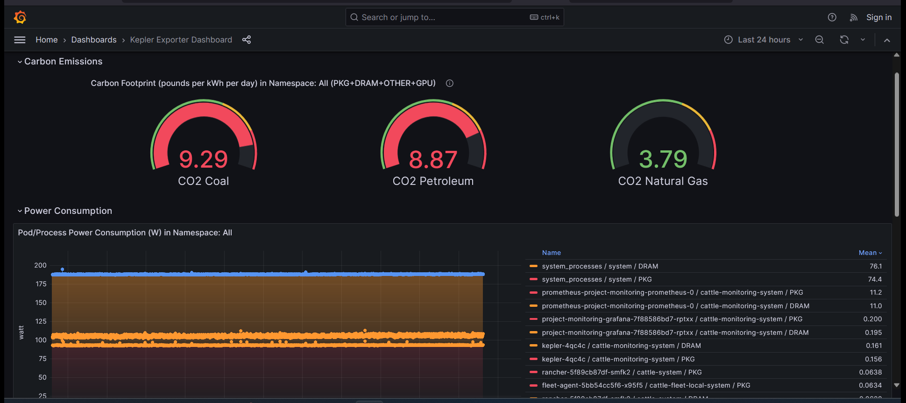
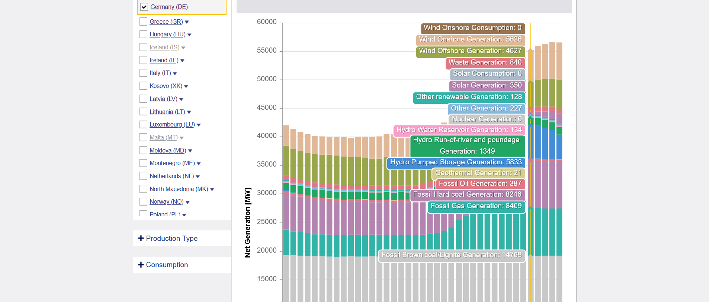

# CaaS Carbon Footprint

This repository contains stuff related [Sustainable Computing](https://sustainable-computing.io/).

## Abstract

Climate change is an omnipresent issue. We are confronted with this in the news every day. The state should do something, or someone, preferably someone else. In addition to all the pollution from cars, planes, ships, the largest producers of carbon dioxide are: data centers. The Internet has had an indescribable career over the last 30 years. If you look at the traffic density at the German internet node De-Cix, there is an all-time high almost every day.

(C) https://www.cloudexpoeurope.de/news/de-cix-thomas-king

And this will increase significantly due to all the computing needs of AI/AI.

Saving computing power is not only necessary for cost reasons, but also for climate protection reasons.

## The project

Measuring the power consumption of electrical devices is relatively easy if you simply connect a measuring device between the socket and the consumer. In physical computers we have the [ACPI service](https://de.wikipedia.org/wiki/Advanced_Configuration_and_Power_Interface). More complicated in goes on Virtual Machines and our target service at CaaS: Container and Kubernetes.
For a long time a lot of science and research was required to become results of Virtual Machine Power Measurements.

Luckily enough the CNCF taking care of it and invented [Kepler - Kubernetes Efficient Power Level Exporter](https://sustainable-computing.io/). Initial inspired to start of CaaS Carbon Footprint was the talk "Using Green Metrics to Monitor your Carbon Footprint by Ida Fürjesová & Niki Manoledaki at the PromCon 2023 in Berlin. You can watch the session on [Youtube Prometheus Channel](https://www.youtube.com/live/pKYhMTJgJUU?si=V1ILM6_cPRAaVxJ6&t=18972)

Project goal is to create awareness to our customer for environmental pollution caused by computing power. First we make environmental pollution visible with power consumption per workload on our Kubernetes cluster. Second, we show when it makes sense to produce workload in an environmentally friendly way. 

We imagine the following possibilities:

- Shift workload in time frames when Green Energy is generated, especially batch jobs, AI train model, system upgrades
- Limit workload if only energy from coal, oil and gas is produced
- Use Green Energy over capacity for social computing like [Folding at Home](https://github.com/eumel8/k8s-supporting-folding-at-home)

For sure, we work in the Enterprise Business, most of our hosted application must run all the time. But you can start in small steps to support environmental protection. Not all goals can reach on the first day.

## Kepler

[Kepler](https://github.com/sustainable-computing-io/kepler) (Kubernetes-based Efficient Power Level Exporter) uses eBPF to probe performance counters and other system stats, use ML models to estimate workload energy consumption based on these stats, and exports them as Prometheus metrics. With Kepler Dashboard this stats are visible in Grafana:

We provide a bundled [Helm Chart](chart) with the origin Kepler chart, to install on cluster level, and a ServiceMonitor which rewrites the namespace label. With that the customer can collect namespaces metrics in [CaaS Project Monitoring](https://github.com/caas-team/caas-project-monitoring) and make the metrics visible on project level.

Kepler has also the option to operate with your own [model server](https://github.com/sustainable-computing-io/kepler-model-server) to train a ML model for your own infrastructre. Nevertheless this can be a lot of work on a multi-cluster environment with different backends (Cloud, VM, Bare Metal). Also the energy mix must be manually configured based on the power consumption of the underlying data center. For sure, there are marketung aspects: "Our energy consumption is always green", but that's not true. It means on days without Green Energy generation you must switch of the data center. And nobody will do this. Look at this [Blog Post](https://www.climatiq.io/blog/measure-greenhouse-gas-emissions-carbon-data-centres-cloud-computing) which compares for example the Green Energy only for the AWS data center world-wide.

## ENTSO-E

[Entso-e](https://transparency.entsoe.eu/dashboard/show) provides central collection and publication of electricity generation in the EU region. It has a [Restful API](https://transparency.entsoe.eu/content/static_content/Static%20content/web%20api/Guide.html) to query power generation in EU regions like Germany separated by generation type like Brown Coal, Gas, Oil, Solar, Nuclear, Wind.

There is a [Python Package](https://github.com/EnergieID/entsoe-py) available to query the API. With this [Flask App](flask/app.py) the related data are collected by type and provided as Prometheus metrics. This [Dockerfile](Dockerfile) builds an image which can be used for a ServiceMonitor to pump the data to Prometheus.

## Credits

Life is for sharing. If you have an issue with the code or want to improve it, feel free to open an issue or an pull request.

